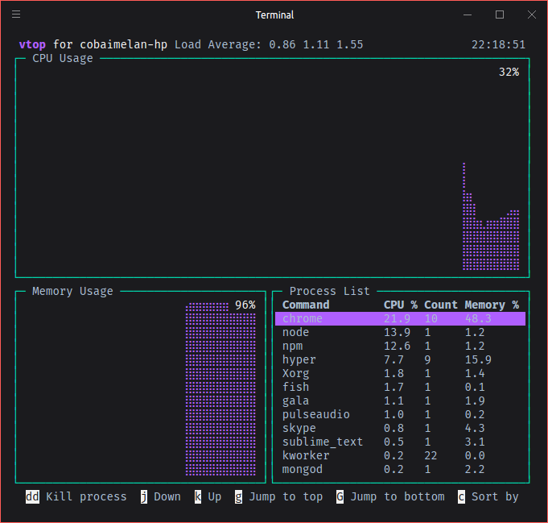

## Fsociety theme for [[Fisherman]](https://github.com/fisherman/fisherman).


## Install


```fish
$ fisher c0b41/fsociety
```


## Features

+ Nodejs version
+ Git status


## Screenshot




# License

[MIT] © [c0b41](https:github.com/c0b41) et [al](https:github.com/c0b41/fsociety/contributors) :heart:
