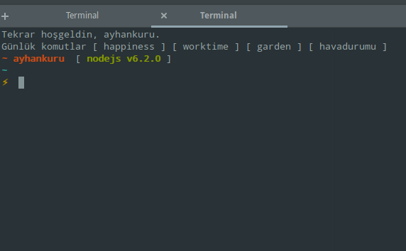
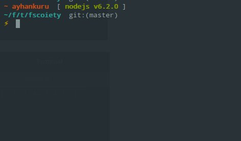
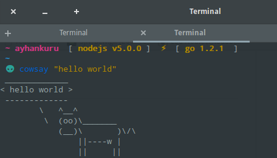

## Fscoiety theme for [Fisherman][wahoo].


## Install


```fish
$ fisher c0b41/fscoiety
```


## Features

+ Nodejs version
+ Git status


## Screenshot

<p align="center">

</p>

<p align="center">

</p>

<p align="center">

</p>
# License

[MIT][mit] © [c0b41][author] et [al][contributors] :heart: